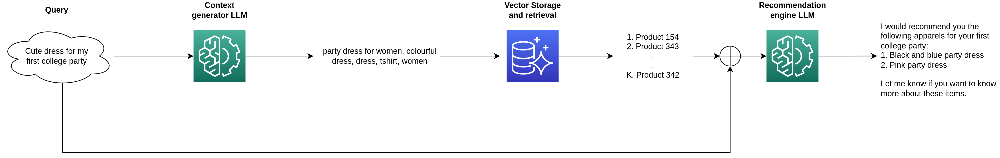
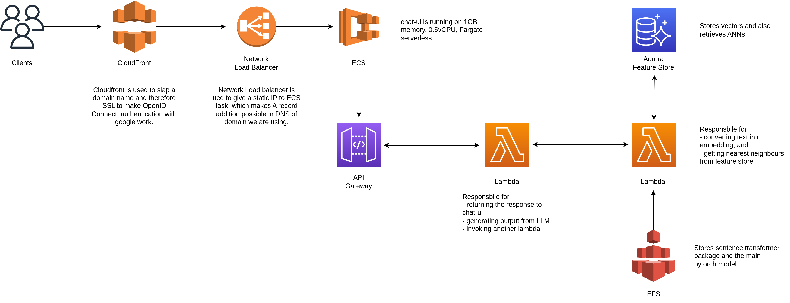

# Recommender System Chatbot with LLMs

Welcome to the repository for the code accompanying the Medium article on "How to make a Recommender System Chatbot with LLMs" 🤖. The article explains the process of creating a session-based apparel recommender system chatbot using open source Large Language Models (LLMs) like OpenAI's ChatGPT.

*Figure 1: System Design - Local Jupyter Notebook Development Flow and Recommendation Engine*

## Repository Contents

### Environment File
- `env.yaml`: Environment file for Conda package manager. Use this for local development on Jupyter Notebook.

### Text Prompts
- `first_llm_prompt`: Text prompt for the first Large Language Model.
- `second_llm_prompt`: Text prompt for the second Large Language Model.

### Jupyter Notebooks
1. `myntra_dataset_feature-store_creation.ipynb`: Prepares the dataset and populates the feature store.

2. `recommender-with-both-llms.ipynb`: Contains the code for the recommendation system, querying from both Large Language Models, and how to interact with them.

## System Design

### Local Development Flow and Recommendation Engine

### Deployed Recommendation Engine on AWS

## Medium Article
Read the detailed guide on Medium: [How to make a Recommender System Chatbot with LLMs](https://mrmaheshrajput.medium.com/how-to-make-a-recommender-system-chatbot-with-llms-770c12bbca4a)

## Getting Started

1. Clone the repository: `git clone https://github.com/your-username/recommender-chatbot-llms.git`
2. Create a Conda environment: `conda env create -f env.yaml`
3. Activate the environment: `conda activate your-environment-name`
4. Open Jupyter Notebook and run the notebooks in the specified order.

Feel free to explore the code and adapt it for your own projects. If you have any questions or feedback, don't hesitate to open an issue or reach out.

Happy coding! 👩‍💻🚀
